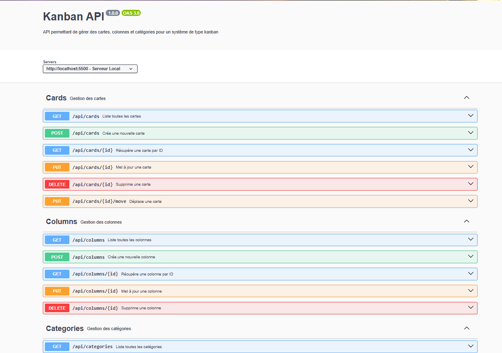

# 📋 Kanban API

## 🚀 Présentation
Bienvenue sur Kanban API, une API REST permettant de gérer Cartes, Colonnes, et Catégories pour créer votre propre tableau Kanban.

🛠️ Conçu avec Node.js, Express, et Sequelize.

## 🛠 Fonctionnalités principales
🃏 CRUD complet sur les cartes

📦 CRUD complet sur les colonnes

🏷️ Gestion des catégories associées aux cartes

🛹 Déplacement de cartes entre colonnes

📚 Documentation Swagger intégrée

## 📦 Stack technique
Technologie | Description
Node.js | Serveur JavaScript
Express | Framework backend rapide
Sequelize | ORM pour bases SQL
Swagger | Documentation API
Jest | Tests unitaires
Supertest | Tests d'intégration HTTP

## 🔥 Installation rapide
```bash
# 1. Cloner le dépôt
git clone https://github.com/Kromaric/kanban.git
cd kanban

# 2. Installer les dépendances
npm install

# 3. Lancer le serveur
npm start
node index
```
Application disponible sur http://localhost:5500

## 📚 Documentation API
Accédez à la documentation interactive :

http://localhost:5500/api-docs

Fichier YAML Swagger : swagger.yaml

## 🧪 Lancer les tests
```bash
npm test
```
(si les tests ne passent pas, commenter le lencement du server dans le fichier index à la racine puis réessayer)
Tests unitaires sur les Cards (create, read, update, delete)

Tests sur le déplacement de carte (moveCard)

Tests sur les Colonnes et Catégories


## ✨ Exemple d'utilisation
Lister toutes les cartes : GET /api/cards

Créer une nouvelle colonne : POST /api/columns

Déplacer une carte : PATCH /api/cards/:id/move

Supprimer une carte : DELETE /api/cards/:id

## 📌 Feuille de route

 CRUD Cards

 Déplacement Cards

 CRUD Columns

 CRUD Categories

 Swagger Documentation

 Tests Unitaires & d'Intégration

 Authentification JWT 🔐 (à venir)

## 🤝 Contribuer
Fork ce dépôt

Créer votre branche : git checkout -b feature/feature-name

Commit vos changements : git commit -m 'Add new feature'

Push votre branche : git push origin feature/feature-name

Créer une Pull Request


## pour plus d'infos contactez-moi  romaricyt11@gmail.com

